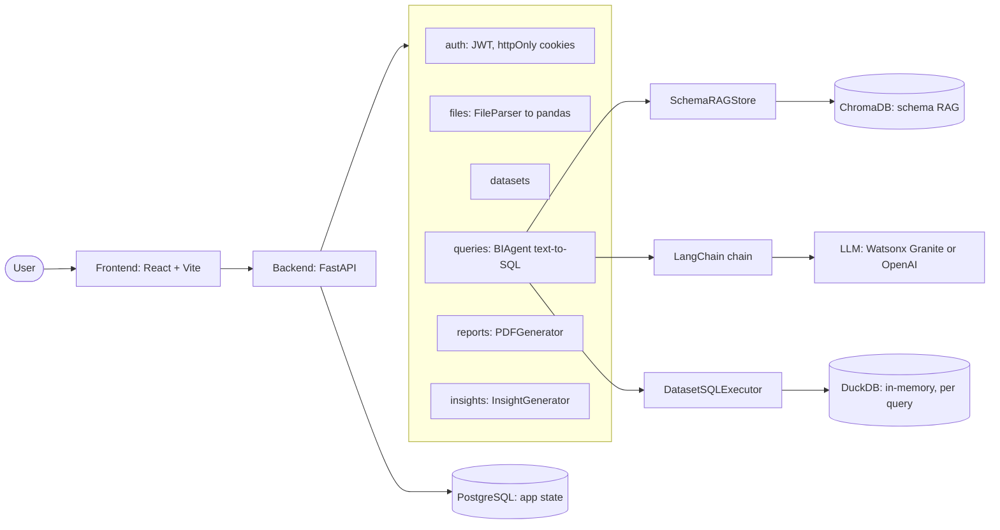

# Architecture

## Overview

The app is a full-stack BI dashboard: upload a data file, ask questions
about it in plain English, get back SQL, results, a chart, and optionally a
PDF report. Four runtime services (Postgres, ChromaDB, FastAPI backend,
React frontend) plus an Nginx reverse proxy used only in the `production`
Docker Compose profile.



## Backend layout

```
backend/app/
├── main.py              FastAPI app factory, lifespan, router wiring, CORS
├── config.py             Pydantic Settings — all env vars in one place
├── api/v1/                One router module per resource (auth, files,
│                          datasets, queries, reports, insights,
│                          visualizations, health)
├── api/dependencies.py    get_current_user() — JWT auth dependency
├── services/              Business logic, one per resource, takes an
│                          AsyncSession and does the actual work
├── ai/
│   ├── agent.py           BIAgent — orchestrates the text-to-SQL pipeline
│   ├── langchain_llms.py  WatsonxGraniteLLM — LangChain LLM wrapper
│   ├── rag_store.py       SchemaRAGStore — ChromaDB-backed column retrieval
│   ├── sql_executor.py    DatasetSQLExecutor — runs SQL via DuckDB
│   ├── validators.py      PromptInjectionValidator
│   └── prompts.py         Prompt templates
├── utils/
│   ├── file_parser.py     CSV/Excel/JSON → pandas DataFrame(s) → column metadata
│   ├── identifiers.py     Sheet name → sanitized, unique SQL-safe table name
│   ├── relationships.py   Cross-table join-key detection (id-like column names)
│   ├── dataset_tables.py  Uniform {table: {columns}} view across single/multi-table datasets
│   ├── insight_generator.py  Statistical anomaly/trend detection
│   ├── ownership.py       get_owned() — shared "fetch-or-404/403" helper
│   ├── background_tasks.py  track() — keeps a strong reference to fire-and-
│   │                      forget asyncio tasks so they aren't GC'd mid-run
│   ├── logger.py          structlog configuration
│   └── pdf_generator.py   ReportLab PDF building
├── db/
│   ├── models.py          SQLAlchemy ORM models (source of truth for schema)
│   ├── session.py         Async engine/session factory
│   └── migrations/        Alembic environment + versioned migrations
├── schemas/               Pydantic request/response models
├── middleware/            Error handlers, request logging
└── core/                  auth.py (JWT/bcrypt), cookies.py, rate_limit.py, exceptions.py
```

## Request lifecycle patterns

**Background tasks with their own DB session.** Any work that outlives the
HTTP request (file parsing, SQL generation, PDF generation) is fired via
`utils/background_tasks.py::track()` — a thin wrapper over
`asyncio.create_task()` that keeps a strong reference to the task so it
can't be silently garbage-collected mid-run — and opens its own
`AsyncSessionLocal()` rather than reusing the request-scoped session, since
that session may already be closed by the time the background task runs.
See `services/file_service.py`, `services/query_service.py`,
`services/report_service.py`.

**Auth returns 401, never 403, for missing/invalid credentials.**
`get_current_user` uses `HTTPBearer(auto_error=False)` specifically so a
missing/malformed `Authorization` header (or cookie) surfaces as
`UnauthorizedError` (401) instead of FastAPI's default 403. 403 is reserved
for ownership/ACL checks (a valid, authenticated user trying to access
someone else's resource) — see `ForbiddenError` usages in the service layer.

## Multi-table datasets

A CSV or JSON file is always a single table (named `data`). An Excel
workbook is parsed sheet-by-sheet — each sheet becomes its own table, keyed
by a sanitized SQL-safe name derived from the original sheet name
(`utils/identifiers.py`). `Dataset.tables_metadata` stores the per-table
column metadata for every sheet; `Dataset.columns_metadata` mirrors the
first (primary) table so single-table consumers keep working unchanged.
`detect_relationships()` (`utils/relationships.py`) runs once at parse time
and heuristically finds likely join keys across tables (normalized shared
id-like column names), storing the result on `Dataset.table_relationships`
for the SQL generation prompt to use.

## The text-to-SQL pipeline (BIAgent.process_question)

1. **Validate** the question via `PromptInjectionValidator` (regex
   blocklist + length/character-ratio checks) — rejects before any LLM call.
2. **Retrieve schema context (RAG).** `SchemaRAGStore` embeds every column of
   every table in a dataset (table-qualified as `table.column`, tagged with
   its table name) into a per-dataset ChromaDB collection when the file
   finishes parsing, using a deterministic local hashing embedding function
   (no external embedding API call). At query time the question is embedded
   the same way and the most relevant columns are retrieved across all
   tables — the number retrieved scales with the dataset's total column
   count (`_dynamic_top_k`: half the columns, bounded to [8, 30]) rather
   than a fixed count. Filtering is coarsened to table granularity: a table
   is kept in full if any one of its columns was retrieved (so join keys
   are never dropped), and dropped entirely if none were. Falls back to the
   full schema of every table if ChromaDB is unreachable or retrieval
   yields nothing.
3. **Generate SQL.** A LangChain `Runnable` chain
   (`PromptTemplate | llm | StrOutputParser()`) drives either
   `WatsonxGraniteLLM` (a custom LangChain `LLM` wrapping the
   `ibm-watsonx-ai` SDK) or `ChatOpenAI`, depending on `default_llm_provider`
   / the request's `ai_model`. Granite init failure falls back to OpenAI
   automatically if a valid key is configured. The prompt lists every
   candidate table's columns with name/type/nullability only — no sample
   data values are included, since this prompt goes to an external LLM
   provider and real values from the uploaded file must not leave the
   system for that call (see `BIAgent._format_schema`).
4. **Execute.** The cleaned SQL runs via `DatasetSQLExecutor` against DuckDB
   tables loaded in-memory from the dataset file's DataFrame(s) — not
   against the app's own Postgres database, so even a successful SQL
   injection is contained to a throwaway in-memory copy of the uploaded
   file. Before execution, `DatasetSQLExecutor._validate_sql` parses the SQL
   with `sqlglot` and enforces: exactly one statement; its root is a SELECT
   (or a set operation / CTE wrapping one) — anything else (INSERT, DROP,
   PRAGMA, …) is rejected by construction rather than by a denylist; and
   every table referenced resolves to one of the dataset's actual known
   table names, so a hallucinated or injected table name fails before
   DuckDB ever sees it. `enable_external_access=false` on the DuckDB
   connection is the backstop layer — even SQL that somehow evaded the
   parser-based checks still can't reach the filesystem or network.
5. **Repair once on failure.** If execution raises, the failed SQL and
   DuckDB's exact error message are sent back to the LLM once for a
   self-correction attempt (`BIAgent._repair_sql`) — a second failure
   propagates rather than retrying indefinitely.
6. **Suggest a visualization** (`bar`/`line`/`pie`/`scatter`/`table`) based
   on the shape of the result set; persisted on the `Query` row and
   consumed by the frontend's `QueryChart` component.
7. **Confidence score.** A heuristic label (not a calibrated ML score)
   starting at 1.0 and reduced for each risk signal observed on that
   specific answer — LLM fallback provider used, RAG-narrowed schema,
   required a repair, or zero rows returned — floored at 0.4 so a
   successfully-executed answer never reads as fully untrusted.

## Why ChromaDB is pinned to `0.5.23` and the client to `0.6.3`

The ChromaDB server changed its collection-config response schema at some
point after 0.5.x in a way that older/newer-mismatched client versions
can't parse (`KeyError: '_type'` on `create_collection`). `0.6.3` (client) /
`0.5.23` (server) is the verified-compatible pair — see the comments in
`docker-compose.yml` and `backend/requirements.txt`. Bump both together,
deliberately, and re-verify against a live container before changing either.

## Database schema management

Alembic is the source of truth for schema in any environment where
`APP_ENV=production`. In development/test, `create_tables()` in
`app/db/session.py` still runs `Base.metadata.create_all()` on startup for
convenience — fast iteration without writing a migration for every model
tweak. See [GUIDE.md](GUIDE.md) for the exact commands.

## API reference

Base URL: `http://localhost:8000/api/v1` (dev). Interactive docs at `/docs`
(Swagger) and `/redoc`, available only when `APP_ENV=development` — both
disabled in production.

All endpoints except `/auth/register`, `/auth/login`, `/auth/refresh`, and
`/health` require a valid access token, sent as an httpOnly cookie (browser
clients) or an `Authorization: Bearer <token>` header (non-browser
clients). A missing or invalid token always returns **401** (not 403).

### Auth — `/auth`

| Method | Path | Body | Notes |
|---|---|---|---|
| POST | `/auth/register` | `{username, email, password, first_name?, last_name?}` | Password: 8–72 chars, needs 1 uppercase + 1 digit. Sets access + refresh token cookies and returns the user. |
| POST | `/auth/login` | `{username, password}` | Same response shape as register. |
| POST | `/auth/refresh` | — (refresh cookie required) | Refresh tokens are stored server-side as a SHA-256 hash and checked for revocation. |
| POST | `/auth/logout` | — (auth required) | Revokes the caller's stored refresh tokens, clears both cookies. |
| GET | `/auth/me` | — (auth required) | Current user profile. |

### Files — `/files`

| Method | Path | Notes |
|---|---|---|
| POST | `/files/upload` | `multipart/form-data`: `file`, `name`, `description?`, `is_public?`. Accepts CSV/XLSX/JSON up to `MAX_UPLOAD_SIZE_MB` (default 100MB). Creates a `Dataset` in `processing` status and returns immediately — parsing runs as a background task. Poll `GET /datasets/{id}` until `status` is `ready` or `error`. |

### Datasets — `/datasets`

| Method | Path | Notes |
|---|---|---|
| GET | `/datasets?page=&limit=&search=` | Paginated list, owner-scoped. |
| GET | `/datasets/{id}` | Response includes `tables_metadata` and `table_relationships` when the dataset has more than one table (multi-sheet Excel) — both `null` for a single-table CSV/JSON dataset. |
| GET | `/datasets/{id}/preview?rows=&offset=&table=` | A page of rows as columns + row arrays. `rows` (max 500) and `offset` page through the data; `table` selects which sheet to preview for a multi-sheet Excel dataset (defaults to the first table; an unknown name falls back to the first table). CSV datasets stream the requested rows without loading the whole file. |
| PUT | `/datasets/{id}` | Update name/description/is_public. |
| DELETE | `/datasets/{id}` | Soft delete (`deleted_at` set) — also removes the dataset's ChromaDB schema collection. |

### Queries — `/queries` (natural language → SQL)

| Method | Path | Notes |
|---|---|---|
| POST | `/queries` | `{dataset_id, question, ai_model?: "granite"\|"openai"}`. Returns `202` with a query ID immediately — SQL generation + execution run as a background task. Poll `GET /queries/{id}` until `status` is `success` or `error`. |
| GET | `/queries/{id}` | Includes `generated_sql`, `results` (capped at 500 rows), `row_count`, `execution_time_ms`, `confidence_score`, `visualization_suggestion` (`bar`\|`line`\|`pie`\|`scatter`\|`table`). |
| GET | `/queries?dataset_id=&page=&limit=` | |
| DELETE | `/queries/{id}` | |

### Reports — `/reports` (PDF generation)

| Method | Path | Notes |
|---|---|---|
| POST | `/reports` | `{dataset_id, title, description?, query_ids: number[], visualization_ids?, include_insights?}`. At least one of `query_ids` (non-empty) or `include_insights=true` is required — rejected with 422 otherwise, since it would generate an empty PDF. Returns `201` with a report ID immediately; PDF generation runs as a background task. |
| GET | `/reports/{id}` | Status: `pending` → `generating` → `completed` \| `error`. |
| GET | `/reports/{id}/download` | Streams the PDF. Requires auth (not a public link). |
| GET | `/reports` | List, owner-scoped. |
| DELETE | `/reports/{id}` | Also deletes the PDF file from disk. |

### Insights — `/insights` (statistical anomaly/trend detection)

Despite the "AI Insights" branding in the UI, detection here is
**statistical** (z-score outliers, null-ratio, skewness), not
LLM-generated. Generated automatically right after a dataset finishes
parsing.

| Method | Path | Notes |
|---|---|---|
| GET | `/insights/{dataset_id}?insight_type=&severity=&limit=` | `insight_type`: `anomaly`\|`trend`\|`outlier`\|`correlation`. `severity`: `low`\|`medium`\|`high`\|`critical`. |
| POST | `/insights/{insight_id}/dismiss` | Soft-dismiss (excluded from future report `include_insights` content). |

### Visualizations — `/visualizations`

CRUD for saved chart configs (`chart_type`, `x_axis`, `y_axis`, `config`
JSON) tied to a query. Separate from the ad-hoc chart rendering
`QueryChart.tsx` does automatically from `visualization_suggestion` — this
is for explicitly saving a chart configuration.

| Method | Path |
|---|---|
| POST | `/visualizations` |
| GET | `/visualizations?query_id=` |
| GET | `/visualizations/{id}` |
| PUT | `/visualizations/{id}` |
| DELETE | `/visualizations/{id}` |

### Health — `/health`

| Method | Path | Notes |
|---|---|---|
| GET | `/health` | Liveness check, no auth required. Used by the Docker healthcheck. |

### Error format

All errors follow FastAPI's standard shape:

```json
{ "detail": "human-readable message" }
```

Validation errors (422) follow Pydantic's standard array-of-errors shape
under `detail`.
